# 户籍管理系统 UML 时序图（PlantUML 统一标准版）

> 本文档包含系统全部12个核心模块的标准PlantUML时序图代码（严格UML生命周期一致版本）

---

## 1. 用户登录 & 权限加载

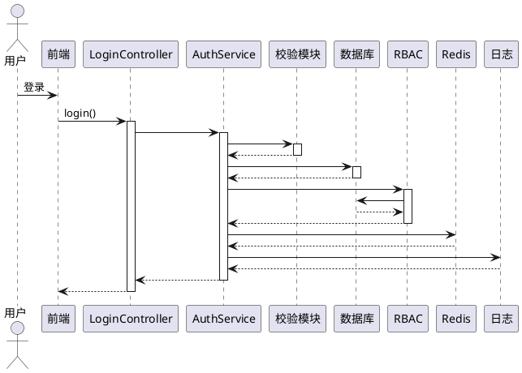

---

## 2. 户籍立户申请 & 审核

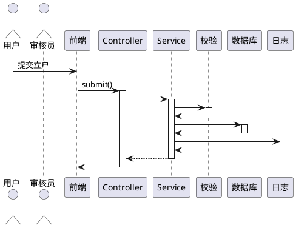

---

## 3. 户口迁入

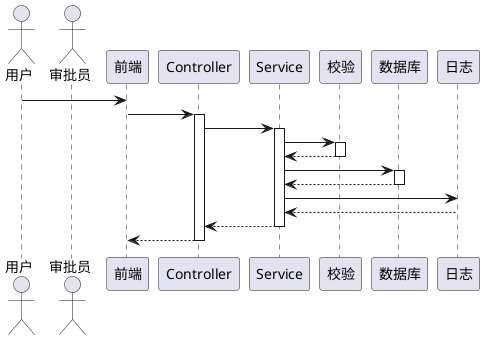

---

## 4. 户口迁出

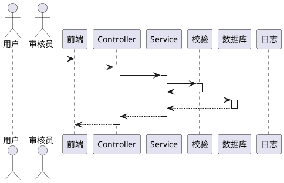

---

## 5. 重点人口管理

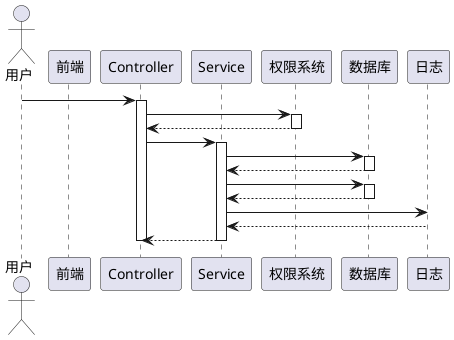

---

## 6. RBAC角色管理

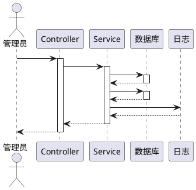

---

## 7. 接口权限控制

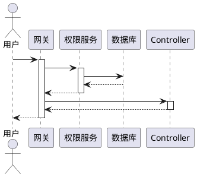

---

## 8. 户籍台账管理

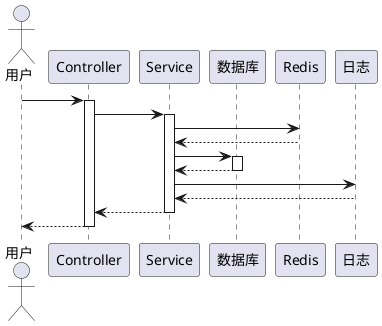

---

## 9. 证件业务管理

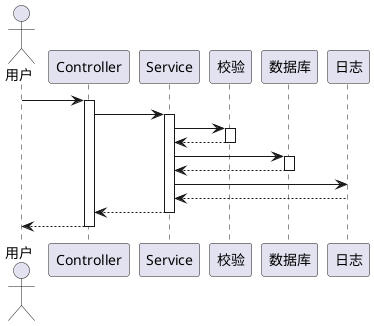

---

## 10. 日志系统

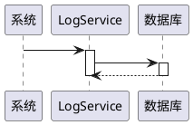

---

## 11. 菜单管理

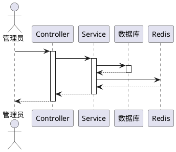

---

## 12. 报表统计分析

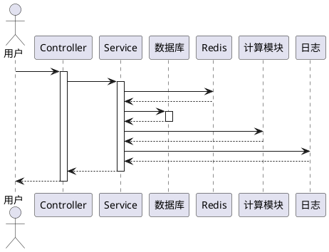

